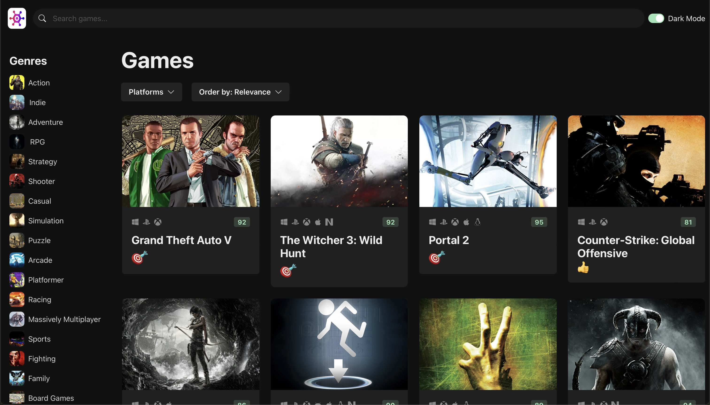
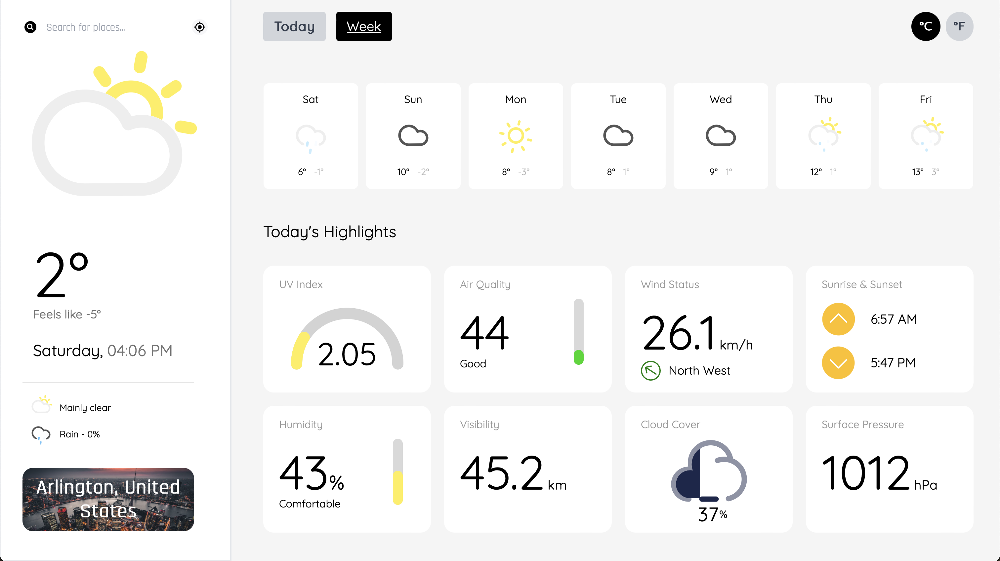
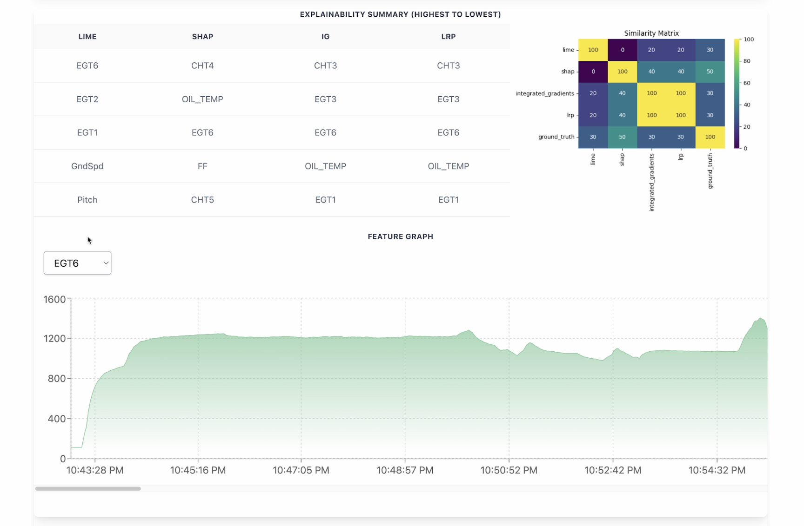

# ✨ Prithviraj K
🏫  Graduate student at George Washington University. 
🖥️  Aspiring Full Stack Developer focused on the MERN stack. 
📊  Currently exploring the depths of Node.js and MongoDB. 
🎸  Avid Guitarist with a knack for fingerstyle.  
🌎  Connect with me!!    

## 💻 Tech Stack

 
 
 
 

 

 
 

## 🏁 Projects
#### Click on the images below to explore each project 😁
<table style="width: 100%; table-layout: fixed;">
  <colgroup>
    <col style="width: 50%"/>
    <col style="width: 50%"/>
  </colgroup>
  <tr>
    <td align="center" valign="top">
      <a href="https://game-hub-bice-nu.vercel.app" target="_blank">
         
        <h3>GameHub</h3>
      </a>
      A website serving as a comprehensive guide to over 5,000 latest games.
    </td>
    <td align="center" valign="top">
      <a href="https://weathora.vercel.app" target="_blank">
         
        <h3>Weathora</h3> 
      </a>
      A user-centric web app delivering accurate real-time climatic conditions.
    </td>
  </tr>
  <tr>
    <td align="center" valign="top">
      <a href="https://youtu.be/zZ8Cx4nzJHo" target="_blank">
         
        <h3>FlightScope Analytics</h3>
      </a>
      A secure web application created using React, Flask, and Python3 for explaining anomalies in real-time flight data.
    </td>
    <!-- Additional projects in the same row -->
  </tr>
  <!-- New rows for Additional projects here -->
</table>
 

## 📊 GitHub Stats
 

### ✍️ Random Dev Quote

<!-- Proudly created with GPRM ( https://gprm.itsvg.in ) -->
